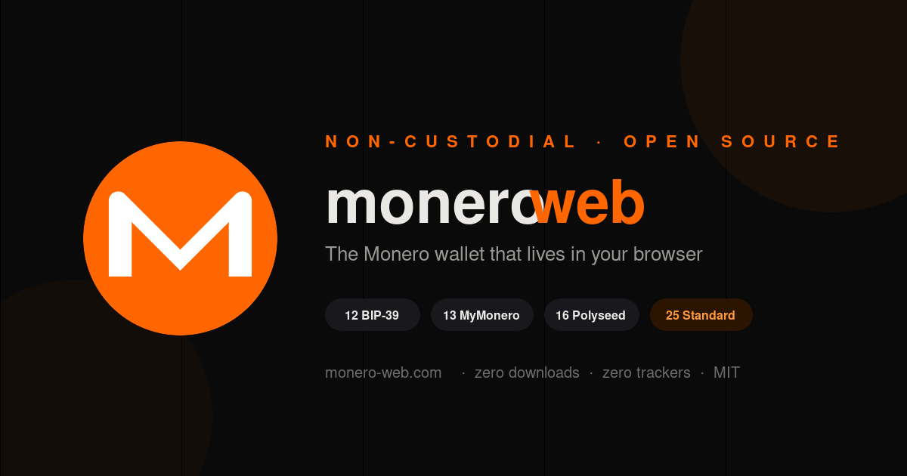

# monero-web



**Open-source, non-custodial Monero web wallet. Your keys never leave your browser.**

Live at [monero-web.com](https://monero-web.com)

## What is this?

A browser-based Monero wallet that runs entirely client-side. No downloads, no extensions, no app stores. Enter your seed phrase or private key and access your wallet from any device.

## Features

- **Create new wallets** — generate a 25-word seed phrase using browser cryptographic RNG
- **Restore from seed** — supports 25-word standard and 13-word MyMonero legacy seeds
- **Import from spend key** — paste your 64-character hex private spend key
- **13 languages** — English, Chinese (simplified), Dutch, Esperanto, French, German, Italian, Japanese, Lojban, Portuguese, Russian, Spanish, English (old)
- **Live network data** — blockchain height, fee estimates, tx pool size via remote node connection
- **Receive with QR** — generate QR codes for your Monero address
- **Non-custodial** — private keys are derived and used in the browser only, never transmitted
- **Zero dependencies** — pure JavaScript crypto engine, no npm, no build tools

## Architecture

```
Browser (client-side)
├── keccak256.js         — Original Keccak-256 (0x01 padding, NOT SHA-3)
├── monero-ed25519.js    — Ed25519 scalar mult, sc_reduce32, CryptoNote base58
├── monero-wordlist.js   — Mnemonic handler with CRC32 checksum verification
├── monero-keys.js       — Key derivation: seed → spend key → view key → address
├── monero-rpc.js        — JSON-RPC client via serverless proxy
└── monero-wordlists     — All 13 language wordlists (1626 words each)

Cloudflare Pages (serverless)
├── functions/api/proxy.js — Smart RPC proxy (prefers own node when synced, falls back to public nodes)
└── functions/_middleware.js — Cache-control headers

Dedicated Server (Hetzner, self-hosted)
├── monerod              — Pruned Monero node (synced, RPC on localhost:18081)
└── monero-lws           — Light-wallet server for balance scanning (REST on localhost:8443)
```

### Key Derivation

```
Seed Phrase (25 words)
    ↓ decode via wordlist
Private Spend Key (32 bytes)
    ↓ sc_reduce32
Private Spend Key (valid scalar)
    ↓ Keccak-256 → sc_reduce32
Private View Key
    ↓ ed25519 base point multiplication
Public Spend Key + Public View Key
    ↓ network byte + pub keys + Keccak checksum → base58
Monero Address (95 characters, starts with 4)
```

### MyMonero 13-word seeds

MyMonero used a different derivation path than standard Monero:
- 12 data words + 1 checksum → 16 bytes
- 16 bytes → Keccak-256 → sc_reduce32 → Private Spend Key
- 16 bytes → Keccak-256 → Keccak-256 → sc_reduce32 → Private View Key

This wallet is one of the few that still supports MyMonero 13-word legacy seeds after MyMonero shut down in January 2026.

## Security

- **Client-side only** — all cryptographic operations run in your browser
- **No key storage** — keys exist only in sessionStorage, cleared when you close the tab
- **No tracking** — no analytics, no cookies, no telemetry
- **Open source** — audit the code yourself
- **Proxy is key-blind** — the Cloudflare Pages proxy forwards RPC requests to Monero nodes but never sees your private keys. The light-wallet server (monero-lws) sees your view key for scanning but never sees your spend key

### What the proxy can see

The serverless proxy forwards JSON-RPC calls to Monero remote nodes. It can see:
- That someone is making RPC requests (blockchain height, fee estimates)
- Transaction broadcasts (the signed tx hex, not the spend key)

It **cannot** see your private keys, seed phrase, or wallet balance.

## Self-hosting

Clone this repo and deploy to any static hosting:

```bash
git clone https://github.com/Medtabka/monero-web.git
cd monero-web
# Deploy to Cloudflare Pages, Vercel, or any static host
# For the RPC proxy, you need Cloudflare Functions or your own backend
# For balance scanning, run monerod + monero-lws on a VPS
```

Or run locally:
```bash
python3 -m http.server 8000
# Open http://localhost:8000/verify.html
# Note: RPC proxy won't work locally, only key derivation
```

## Tests

The crypto engine has Node-runnable tests for the new code paths:

```bash
node tests/test-new-paths.js
```

This exercises BIP-39, polyseed (canonical + 4-char-prefix), subaddress
generation, network selection (mainnet / stagenet / testnet), and the
WalletVault encrypted session-storage round-trip.

## Threat model

This wallet is designed to keep your spend key out of any system you don't control.
Below is what it does and does not protect against — please read this before
trusting it with significant funds.

**Invariant enforced by CI:** every byte the browser executes (HTML, JS, CSS,
fonts, images, the QR encoder library) is served from `monero-web.com`. The
build pipeline fails if any HTML file references an external CDN URL. There
is no `<script src="https://cdn.example.com/...">` anywhere in the project,
ever, by construction. This means there is no third-party JavaScript supply
chain to compromise.

**What monero-web protects against:**

- **A compromised or malicious server.** All key derivation, all signing, and all
  address generation happen inside your browser tab. The Cloudflare host that serves
  the static files never sees your seed, keys, or balance. Even the RPC proxy
  is key-blind: it sees blockchain queries, not wallet contents.
- **A compromised npm dependency.** There are no dependencies. The crypto engine
  is hand-written JavaScript checked into this repo. There is no `package.json`,
  no transitive dep tree, and no build pipeline that could swap in malicious code.
- **A compromised "remote node" you connect to.** RPC traffic goes through the
  proxy by default; you can set a custom node from the dashboard if you prefer.
  In neither case does the node ever receive your private keys.
- **Memory snapshots while idle.** With a session password set, the keys are
  AES-GCM encrypted in `sessionStorage`. After 10 minutes of inactivity the
  page reloads, dropping the in-memory copy and forcing re-unlock.
- **Tab close / browser restart.** Keys live in `sessionStorage`, not
  `localStorage`. Closing the tab wipes them.

**What monero-web does NOT protect against:**

- **A compromised browser extension.** Extensions with broad permissions can read
  page content, intercept clipboard reads, and exfiltrate keys. Use a clean
  browser profile (or a separate browser entirely) when handling significant
  funds.
- **A compromised operating system.** Keystroke loggers, screen recorders,
  rootkits, and process-memory readers can all defeat any browser-based wallet.
- **Hostile DNS / a TLS MITM with a rogue CA.** If an attacker can serve you
  modified JavaScript under the `monero-web.com` origin, they can ship a wallet
  that emails them your seed. Mitigations: pin a known-good commit, run from
  the local repo (`python3 -m http.server`), or self-host.
- **XSS.** A successful injection on the origin can read everything in the
  page, including your in-memory keys. The site sets a strict CSP and ships no
  user-generated content, but no defense is perfect.
- **You typing your seed into a fake clone.** Always check the URL.
  `monero-web.com` is the only canonical host.
- **Phishing for your session password.** The session password protects the
  encrypted-at-rest blob in `sessionStorage`, not the in-memory keys. While
  the dashboard is unlocked the keys are decrypted in JS memory.
- **Send-side key exposure.** Sending Monero requires the spend key to be in
  memory at signing time. The send flow uses the mymonero-core WASM module to
  sign transactions client-side — the spend key stays in the browser and is
  never sent to the server — but it is still present in JS memory while the
  dashboard tab is unlocked.

If your threat model includes nation-state actors or you're moving funds you
can't afford to lose, use Monero CLI on an air-gapped machine.

## Roadmap

- [x] Key derivation engine (Keccak-256, Ed25519, sc_reduce32)
- [x] 12-word BIP-39 support (PBKDF2-SHA512 + SLIP-0010 ed25519)
- [x] 13-word MyMonero seed support
- [x] 16-word Polyseed support (GF(2¹¹) checksum + PBKDF2-SHA256 KDF)
- [x] 25-word standard Monero seed (all 13 wordlist languages)
- [x] Subaddress generation (`8…` mainnet)
- [x] Watch-only import (address + view key)
- [x] Network selector (mainnet / stagenet / testnet)
- [x] Encrypted session storage (AES-GCM via PBKDF2-SHA256)
- [x] Idle auto-lock with re-unlock prompt
- [x] Custom node URL (bypass the proxy)
- [x] Wallet JSON export
- [x] Receive screen with client-side QR code
- [x] Live network data via remote node
- [x] Balance scanning via self-hosted monero-lws (light-wallet server)
- [x] Send XMR with client-side WASM transaction signing (mymonero-core-js)
- [x] Transaction history via LWS
- [x] Address book / labeled subaddresses with localStorage persistence
- [x] QR code scanner for `monero:` URIs (camera-based, vendored jsQR)
- [x] Strict CSP without `'unsafe-inline'` for scripts
- [x] DNSSEC end-to-end (Cloudflare + Porkbun)
- [x] Self-hosted monerod (pruned) + monero-lws on Hetzner CAX21
- [x] Smart RPC proxy (auto-fails over to public nodes when own node is down)
- [ ] Swap integration (ChangeNow / Majestic Bank)
- [ ] PWA support (install on home screen)

## Why?

MyMonero shut down in January 2026, leaving users of its 13-word seed format without a web wallet. Cake Wallet doesn't accept 13-word MyMonero seeds. This project fills that gap and supports all Monero seed formats in one place.

## Contributing

PRs welcome. The crypto code is intentionally kept simple and dependency-free for auditability.

## License

MIT

## Donate

monero-web is free, MIT-licensed, and has no token, no premium tier, and no
ads. If you find it useful, XMR donations are very appreciated and go directly
to keeping the project alive:

```
47RzzwG62wBc5zDLm3M3xGUJAw7AY6vnW4hSHqo1jyJF1UsHCv56pPLgw4LAGwgfEe5RrR9SwaatBXtr77ZMW7sgTVZeRCz
```
